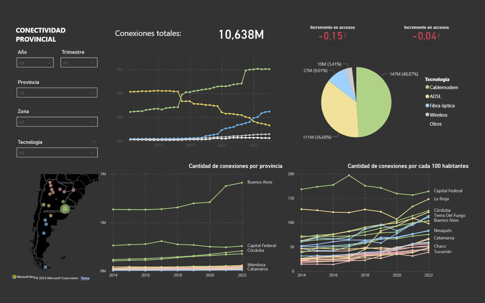

# DA - Potential communications market analysis 

This repository documents the analysis of internet services distribution to identify market oportunities. The project is organized into the following key stages:

[01_ETL](01_ETL.ipynb): Initial data transformation.

[02_EDA](02_EDA.ipynb): Exploratory data analysis.

[03_DASHBOARD](gallery/Power_BI_Dashboard-01.jpg): Data visualization.

---

#### [01_ETL:](01_ETL.ipynb) Initial data transformation.

This stage involves the data initial transformation of the datasets. Sources: 
 - [datosabiertos.enacom](https://datosabiertos.enacom.gob.ar/dashboards/20000/acceso-a-internet/)

---

#### [02_EDA:](02_EDA.ipynb) Exploratory data analysis.

I perform an Exploratory Data Analysis (EDA) to search for potential markets and strategies. The analysis includes the general tendencies, and how they change within each zone of the countr and a brief conclution for each zone:

---

#### [03_DASHBOARD:](02_DASHBOARD.pbix) Data visualization.

---

#### Libraries and tools

- Python: Primary programming language for data preprocessing, analysis, and modeling.
- Jupyter Notebook: Interactive environment for running Python code.
- Pandas: Data manipulation and analysis.
- GeoPandas: Geographical data manipulation and visualization.
- NumPy: Python library for numerical operations and array handling.
- Matplotlib and Seaborn: Data visualization
- Git: Tracking changes in the codebase and collaborating with others.
- Power BI - Interactive dashboard

---

#### Files
    
The files include...

- [data](data/): Here, you can find the unprocessed and processed data files.

- [lib](lib/):  Here, I store some recurring visualizations and transformations.

- [gallery](gallery/): Here I store all the data visualizations in png format.

---

#### Contact

Feel free to contact: julliercapellojoaquin@gmail.com

